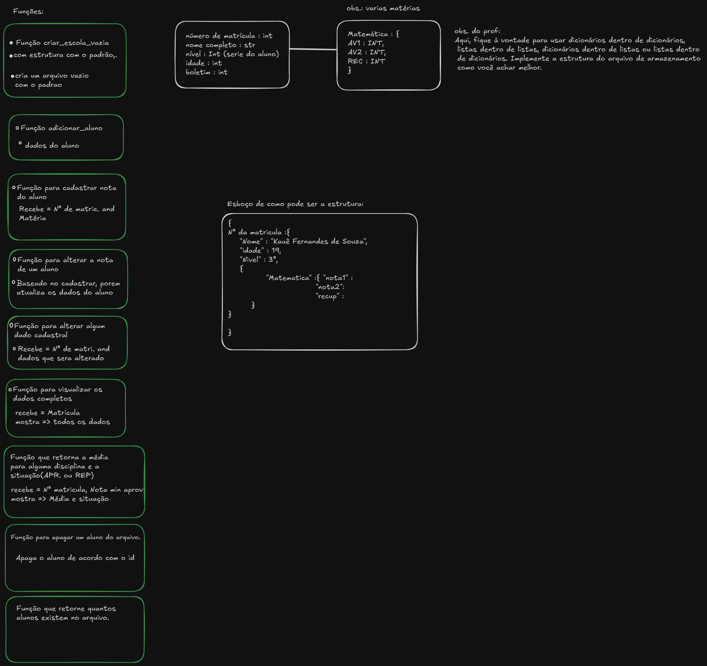

# Projeto Escola Ada

Este é um projeto desenvolvido em Python usando Notebook, com o objetivo de criar um sistema de gerenciamento escolar para a fictícia "Escola Ada". O projeto foi organizado em módulos para garantir uma interface intuitiva, facilitando o uso por gestores escolares.

O motivo da execução desse codigo foi para um projeto final de **Logica de programação II**

Para uma experiência ideal e um painel visualmente organizado, recomenda-se a execução do notebook no [Google Colab](https://colab.research.google.com/), o que oferece maior compatibilidade de visualização e acessibilidade de recursos.

## Tabela de Conteúdos
- [Descrição](#descrição)
- [Organização do Projeto](#organização-do-projeto)
- [Funcionalidades](#funcionalidades)
- [Metodologia](#metodologia)
- [Instalação](#instalação)

---

## Descrição

O Projeto Escola Ada é um sistema de gestão escolar que permite o gerenciamento de dados como alunos, professores, turmas e disciplinas. Com o uso de Google Colab, o sistema é facilmente acessado e configurado, permitindo que as operações escolares sejam realizadas em uma plataforma prática.

O notebook inclui um painel com interface organizada, oferecendo uma experiência de usuário otimizada e simplificada, ajudando na navegação e execução de tarefas de forma intuitiva.

---

## Organização do Projeto

O projeto foi estruturado em seções modulares para facilitar a organização dos dados e melhorar a usabilidade:

- **Dados de Alunos e Professores**: Módulos dedicados à entrada, visualização e gerenciamento das informações de alunos e professores.
- **Turmas e Disciplinas**: Organização de turmas com a associação de disciplinas e professores responsáveis.
- **Relatórios e Visualizações**: Funções para geração de relatórios e visualizações gráficas, quando aplicável.
- **Painel de Controle**: Estruturado no Google Colab para oferecer uma experiência visual aprimorada, onde o usuário pode navegar facilmente entre as funcionalidades, realizar operações de entrada de dados e consultar informações de forma intuitiva.

---

## Funcionalidades

O sistema conta com várias funcionalidades que facilitam o gerenciamento de informações escolares:

- **Gerenciamento de Alunos**: Adicionar, visualizar, atualizar e remover dados de alunos.
- **Gerenciamento de Professores**: Manipular informações dos professores, incluindo disciplinas que ensinam e turmas associadas.
- **Cadastro de Turmas e Disciplinas**: Organizar as turmas e associá-las a disciplinas específicas, com professores responsáveis.
- **Geração de Relatórios**: Criar relatórios  e distribuição de dados, visualizando informações relevantes para a gestão escolar.
- **Painel de Controle Simplificado**: O painel foi projetado para ser intuitivo e fácil de navegar com módulos divididos.

---

## Metodologia

Antes de iniciar o desenvolvimento, foi utilizado um **mapa mental** ultilzando o site [Excalidraw](https://excalidraw.com/), para planejar as funcionalidades e a estrutura do projeto.  Abaixo estão os principais pontos do método de planejamento:

obs.: As funcionalidades foram baseadas na Descrição do projeto que foi fornecida pelo professor.

1. **Identificação das Necessidades**: Listamos as necessidades do sistema, como o gerenciamento de dados de alunos e professores, turmas e disciplinas.
2. **Organização dos Módulos**: Dividimos o sistema em módulos (Alunos, Professores, Turmas, Disciplinas, e Relatórios) para facilitar a implementação e o uso.
3. **Estrutura do Painel**: Planejamos um painel visualmente organizado e intuitivo, com menus e navegação simples, ideal para ser visualizado no Google Colab.
4. **Teste e Validação**: Cada módulo foi testado individualmente para garantir a integridade dos dados e a funcionalidade do sistema como um todo.

O mapa mental ajudou a garantir que todas as funcionalidades fossem implementadas de maneira lógica e prática, com foco na usabilidade.

---

## Instalação

Para executar o projeto no Google Colab, siga estas instruções:

1. Acesse o [Google Colab](https://colab.research.google.com/).
2. Faça o upload do arquivo `Projeto_Escola_Ada.ipynb`.
